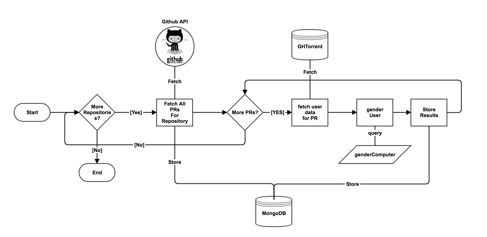

Introduction {#Introduction}
============

development has adapted to the needs for distributed development through
the concepts of social coding and pull based software development pushed
by platforms like GitHub which provide a platform for some of the
biggest projects existing. Projects like rails, docker, angular, node or
swift are publicly hosted with some of them having thousands of
followers and contributors. Open Source software development has been
described as meritocracies [@Scacchi:2007:FSS:1295014.1295019], however
recent research has identified social factors to influence decisions of
project managers. This holds also true for the acceptance of
contributions by others through s. [@Tsay:2014:IST:2568225.2568315].
Inevitably, a social coding environment such as GitHub is accompanied
with social interaction that influences the project progress.

An obvious factor in social interaction is gender. Research has shown
that women are being treated unequal in professional environments,
receive promotions less likely than men and are less likely to be hired
when compared to male competition
[@Davison2000225; @doi:10.1177/0149206310374774]. and more specifically
projects have been shown to exhibit sexist behavior. About 1.5% of the
total number of members in communities of *’’* were determined to be
female compared to 28% in proprietary software as determined in a 2005
report by the University of Cambridge [@flosspols-gender:2005]. More
current research shows a percentage of about 9% female users on GitHub
[@Vasilescu:2015:GTD:2702123.2702549].

@10.2307/23443867 found equal gender mix teams to perform better than
male or female dominated teams in the context of business students.
Increased mutual monitoring, a form of informal Clan Control
[@doi:10.1287/orsc.7.1.1], was found to be a strong beneficial factor in
mixed gender teams.

@Vasilescu:2015:GTD:2702123.2702549 more specifically found gender
diversity to have beneficial effects on team performance. This creates
an economic incentive for organizations to promote diversity in their
teams and communities.

@Tsay:2014:IST:2568225.2568315 found project managers to use social cues
to evaluate contributions and @Vasilescu:2015:GTD:2702123.2702549 found
almost half of the project members to be aware of other users gender.
Consequently the effect of the perceived gender on this contribution
process can be of interest in the ongoing debate of gender inequality.
Current research performed by @genderdiff:2016 has identified a
significant difference between the acceptance rate of quests created by
men and women. Women whose profile publicly display their gender have a
4.1% lower chance of their being accepted compared to mens and a 10%
lower chance than those women that did not disclose their gender. This
is especially interesting as this percentage only holds true for
’visible’ women. Those that decided to withhold information about their
gender in their profile have a higher chance of having their request
accepted.

In their research, @genderdiff:2016 have analyzed a variety of different
topology factors on the dataset. They have analyzed their results for
different biases most notably an extensive covariate analysis which
showed no explanations for the bias towards men. They also analyzed
different programming languages and their relation to the acceptance
rates. They however did not compare gender-dependent acceptance rates on
a project level, allowing project specific environment and culture to
explain the discovered differences.

These factors, the underrepresentation of women on GitHub, the observed
sexist behavior within communities as well as the social influences on
decisions that were believed to be purely lead by meritocratic reasoning
raise the following question: *Can project level differences in
acceptance rates of s between genders be observed on GitHub?* To answer
the research question and due to the large amount of data accessible,
data analytics techniques need to be applied. To ensure sufficient data
is available per project, the biggest 100 projects on GitHub are
selected [^1].

This paper quantitatively analyzes differences of gender participation
between projects. It does not try to determine the relevance of gender
in comparison to other social cues in the process of deciding whether to
merge or decline a . Instead, this work is looking for project level
differences in gender dependent statistics. The structure of the paper
is as follows: First, some background on gender inequality research in
professional settings and more specifically in will be provided.
Afterwards, general research on GitHub data is reviewed and the most
recent research of gender influences on GitHub will be introduced. In
the next chapter, the research method and data acquisition will be
described to facilitate the reproducibility of this work. Subsequently
the results will be presented and discussed. Finally limitations and
ideas for further research complete the paper.

Background and Theory
=====================

Past research on online communities has analyzed effects of gender,
tenure, network embeddedness and other social factors on individual
participation, team performance and project success.
[@Vasilescu:2015:GTD:2702123.2702549; @vasilescu:2012:6542459; @doi:10.1287/mnsc.1060.0550].
Results show influences of social cues on peer performance evaluation as
well as effects of network embeddedness to generally positively
influence project success.

Gender has been a particular topic in past research as the ratio of male
to female participants in has historically always been low with surveys
ranging from 1-5% in 2006 and recent surveys from 2013 showing results
of about 10% female participants
[@Vasilescu:2015:GTD:2702123.2702549; @flosspols-gender:2005]. This
chapter will first touch on gender inequality in and then summarize
previous research performed on GitHub data.

Gender inequality in OSS
------------------------

The from 2006 has clearly described the underrepresentation of women in
. Studies between 2002 and 2006 reported low one digit percentages of
women participating in and these numbers have increased slightly in the
last years [@Vasilescu:2015:GTD:2702123.2702549]. Reasons for these
numbers have been summarized in the by @flosspols-gender:2005. The
authors report cultural and social arrangements such as a ’hacker ethic’
and ’individuals as carriers of agency’ as strong reasons for this
inequality. The culture of is being described as code-centric instead of
product-centric, leading contributions to be evaluated as less relevant
if they are not code-based. The culture revolves around online community
inherent concepts such as ’flaming’ which ’can be off-putting for
newcomers \[and\] is particularly pronounced in the case of women, who
\[...\] have a shorter history in computing’ [@flosspols-gender:2005
p.6].

Using GitHub as a research data set
-----------------------------------

With the changing of the tools used by developer communities in recent
years, many older research used websites such as SourceForge or
StackOverflow as their sources of data for empirical research
[@vasilescu:2012:6542459; @doi:10.1287/mnsc.1060.0550]. Newer research
has moved towards GitHub as it is now the biggest source for publicly
available software projects [@Vasilescu:2015:GTD:2702123.2702549].

### Gender and Tenure diversity in GitHub Teams

According to @Vasilescu:2015:GTD:2702123.2702549, diversity is a
significant predictor for team productivity. A survey of 4,500 GitHub
users showed about half the users were aware of most of their teammates
gender, making it the second most salient attribute after programming
skills. This “contradicts earlier claims of obscurity of gender in OSS”.
Furthermore, there are differences in the subjective importance of
diversity in teams. Some respondents did not consider diversity to be
relevant as it is “more about the contributions to the code than the
‘characteristics’ of the person” while others characterize diversity as
a “source of creativity”. Overall, gender diversity is positively
correlated with project productivity and highly significant. Finally,
gender diversity negatively impacts turnover, helping projects to
sustain their developer base [@Vasilescu:2015:GTD:2702123.2702549].

### Promises and perils of mining Git(Hub)

@perils-ms-research:2009 and later @perils-github:2015 have analyzed the
data available on git based projects and GitHub data to define a number
of guidelines for researchers when approaching these types of data.
While the research by @perils-ms-research:2009 focused on Git, the
underlying versioning system of GitHub, @perils-github:2015 focused on
GitHub specifically. The perils defined should be taken into account
when analyzing GitHub based data and are therefore listed below:

1.  A repository is not necessarily a project

2.  Most projects have very few commits

3.  Most projects are inactive

4.  A large portion of repositories are not for software development

5.  Two thirds of projects (71.6% of repositories) are personal

6.  Only a fraction of projects use s. And of those that use them, their
    use is very skewed

7.  If the commits in a pull-request are reworked (in response to
    comments) GitHub records only the commits that are the result of the
    peer-review, not the original commits

8.  Most s appear as non-merged even if they are actually merged

9.  Many active projects do not conduct all their software development
    in GitHub

Peril 1-3,5 are not applicable to this research as it focuses on the
most popular projects.

Peril 4 is relevant. It confronts the fact that GitHub, although mainly
considered to be a software development code sharing platform, actually
hosts many different projects as well. As an example, the top 20
projects on GitHub include “free-programming-books” and
“You-Dont-Know-JS”, repositories containing books, “awesome”, a
repository containing a list of links to resources and “gitignore”, a
project including templates for a type of file often used on GitHub. If
significant differences in gender/acceptance rates can be observed, the
affected projects need to be controlled for being actual software
development projects.

Peril 6 is relevant and results also need to be checked against this
problem The most notable project is “linux” which is hosting a mirror of
the linux kernel git repository. s are not accepted via GitHub and all s
are closed without merge and the creators references to the propper
hosting site.

Peril 7 is not relevant as we are not analyzing the contents of s but
only their states.

Peril 8 and 9 are relevant. The fact that many s appear as non-merged
although they actually were introduces a bias in the data and reduces
the overall percentage of merged s. There is however no obvious reason
to believe there are more s that have this false negative value for one
or the other gender. Peril 9 shows a limitation of this work which is
the narrow focus on s as an indicator for gender differences. It
suggests a big part of software development occurs in many different
areas, be it forums, chats or mailing lists [@perils-github:2015].

The final conclusion of @perils-github:2015 is to carefully select the
repositories analyzed and ensure the data acquired is actually suitable
to answer the research question.

### Research into acceptance factors

This work leans on the work of @Tsay:2014:IST:2568225.2568315 who
analyzed factors that may predict the acceptance of a as well as
@genderdiff:2016 who focused this analysis further towards gender
differences.

@Tsay:2014:IST:2568225.2568315 showed the number of comments as well as
the age of a repository were the best predictors for determining whether
a would be accepted or rejected. Also, the amount of previous
interaction between the submitter and the project manager deciding to
merge the influences the likelihood of a merge. In summary they observed
a social factor in the evaluation processes of project managers and
therefore gave reason to the research investigating detailed social
factors in the space of on GitHub.

@genderdiff:2016 have continued this research path and investigated the
influence of gender on the evaluation process. They used similar data
sources as others and enriched those with gender information for users,
a process repeated in this work. Based on this data they could correlate
gender and acceptance statistics, finding womens’ acceptance rates were
higher but only for those women that did not reveal this gender in the
space of GitHub. If they did so and their gender was clearly visible on
the platform (through names or photos), their acceptance rate was lower
than those of men. Due to the large number of s analyzed, statistical
significance is easily achieved. @Davison2000225’s meta-analysis on sex
discrimination found an average Pearson correlation of $\rho = 0.07$
between gender and job selection which, compared with the results of
@genderdiff:2016 of $\rho = 0.02$ is higher. The results are therefore
less impactful than the average sexual discrimination observed, yet they
can still be interesting to further understand, especially in seemingly
meritocratic environments. Also, a project level investigation might
reveal a strong variance in this correlation, revealing projects with
stronger correlations.

Methods and Data
================

To determine project level differences, three subtasks can be identified
that need to be completed for the question to be answered adequately.
Acquiring the data, preparing it and analyzing it. To retrieve and
prepare the data, a NodeJS tool has been written that combines data from
GHTorrent as well as using the GitHub to acquire all necessary data. All
data was locally stored in a NoSQL Mongo database and later transferred
to files that could easily be imported to Microsoft Excel for the final
statistical calculations and validations.

Data acquisition
----------------

Fetching the data included first fetching the s for each repository.
This was performed using the GitHub REST , a public interface for
programs and applications to interact with GitHub. Each batch of s was
then processed and placed into a queue which processed the s one at a
time. For each , the GitHub user that created it was queried from the
GHTorrent database and cached locally since many s were created by
similar users. The entire software to collect, analyze and store this
data was written in NodeJS, a based runtime environment that allows for
easy handling of many parallel web requests as well as handling
documents easily. Both underlying database as well as the GitHub consume
and produce documents and as such, a based technology was reasonable.

GHTorrent data set
------------------

@Gousi13 created the GHTorrent project. It watches the event stream of
GitHub and stores everything in two separate databases, a relational
database and a document based database, namely a MongoDB database.
Researchers can get access to these databases by donating a GitHub key
and perform queries which are more versatile than the GitHub itself. It
also allows for a higher number of queries per hour, which GitHub limits
to 5000 every 60 minutes. This allowed for a much quicker determination
of the genders as a request was required for each user profile and over
40,000 users were involved in the analyzed s.

Determining Gender
------------------

After the necessary data was collected the users profile was used to
determine the gender. For each user a gender inference was attempted
from their login name, their email address and their full name. Not
every user has all three attributes added to their profile. 74% of all s
were created by users with a full name added to their profile, allowing
for a much higher success rate in inferring gender from profiles than by
simply using the login name as was done in previous analyses.

### Gendercomputer

To infer the gender, the `genderComputer` by @vasilescu:2012:6542459 was
used. This algorithm uses several heuristics such as the origin/country
of the user as well as common name patterns and ultimately a name-gender
dictionary to infer the gender from a given user. It has a reported
success rate of about 32% [@Vasilescu:2015:GTD:2702123.2702549] using
profile names. In this study a higher success rate was achieved due to
the availability of full names which can be added by users on GitHub and
was done by 66% of the users that were analyzed.

### Social network profile matching

@genderdiff:2016 suggested an additional external verification of gender
through the consultation of social network s such as Google+ to
determine gender of those users that are not identifiable through the
previous step. This work only used the `genderComputer` tool as it is
simpler to user and offered already high success rates due to the now
available data of real names of users. An additional verification with
facebook would have been desirable as it is much more adopted than
Google+ [@googleplusstats:2015; @facebookstats:2017]. However, the
company does not offer an that allows for resolving profiles from email
addresses. Hence the previously mentioned tool was the most efficient
and effective approach to analyze all 43130 users that created the s.

Determining acceptance
----------------------

To ensure higher precision of the merged status
@Gousios:2014:ESP:2568225.2568260 suggest a manual approach for
determining the ultimate merging decision for each merge. This approach
ensures that all merged s are captured. This is due to the setup of
GitHub, allowing for s to either be merged through GitHub’s own
facilities but also through Git, the underlying technology of GitHub,
using its native merge tools. The GitHub provides a flag “merged\_at”
flag which indicated those s that have been merged through the GitHub
UI. Since the UI transfers information about gender more easily through
profile pictures and linked profiles than a command line based tool,
those s are actually of higher interest for this study. To rate the
acceptance of a contribution, we therefore consider a merged that has
been flagged so by the GitHub systems to be an accepted contribution and
a closed but not merged to be a rejected contribution.

![Screenshot of
[]{data-label="figure:prexample"}](graphics/PRexample.png){width="1\columnwidth"}

The entire processing chain is summarized in
Figure \[figure:flowchart\_processing\]. In the actual implementation, a
parallel architecture was used as well as a database backed prioritized
queue to better handle the large amount of s and repositories while
allowing for pausing and restarting of the processing engine.[^2]

{width="\textwidth"}

After the data preparation, the analysis of the data can be performed.
To analyze the differences between projects, all past s of each project
are analyzed. For each , a tuple of id, repository, creator’s gender and
merge result is created.

Results
=======

A total of 43,039 users and 183,249 s were analyzed. The
`genderComputer` determined the gender of 63.23% of the total number of
users, determining the gender from their provided real name, their
username and then their email address in descending order of result
prioritization. The success rate was higher than those reported by
@vasilescu:2012:6542459, most likely because we focused on s that were
in the largest projects on GitHub. Users in these repositories have more
complete profiles in comparison to the large long tail of small and
empty or personal projects, with 66.15% of all users analyzed having
entered their name to their profiles, although its an optional field. Of
the gendered users, a total of 1985 or 7.27% were female which is
slightly lower than the 9% reported by [@vasilescu:2012:6542459]. Women
have created on average 4.18 and men 4.69 s.

Using the gender linked s and user profiles, summary statistics were
created for each project. A sample of these results is shown in
Table \[table:sampledata\].

[ l | l | l | l ]{} **Attribute** & **angular** & **docker** &
**ghost**\

PR Count &2369 & 15146&1738\
PR merged count &720 & 12024&1323\
PR declined count &1649 & 3122 &415\
Male PRs &1586 & 9445 &867\
Female PRs &161 & 980 &280\
unknown gender PRs &622 & 4721 &591\
male merged count &494 & 7664 &640\
male declined count &1092 & 1781 &227\
female merged count &66 & 820 &256\
female declined count &95 & 160 &24\

To analyze the results, the chi-squared test for statistical
significance was used. This test offers the ability to determine
correlation between two variables [@chi2016springer p.102ff.]. In the
study the correlation between the expected number of declined or merged
s for each gender and the actual number was to be determined.

To evaluate correlation and calculate statistical significance, the
chi-squared pearson test requires the calculation of a test statistic
$ \chi^2 $ which is then compared to a chi-squared probability of a
defined probability barrier (0.005 in this study). The formula for
calculating the test statistic is visible in
Equation \[equation:statistic\].

$$\label{equation:statistic}
\chi^2= \sum_{i=1}^{r} \sum_{j=1}^{c} \frac{(O_{i,j} - E_{i,j})^2}{E_{i,j}}$$

In this study, both $r$ and $c$ were 2, causing $df = 1$ and
$\alpha = 7.879$ with $\chi^2(p<0.005, df=1)$.

Out of the 100 projects analyzed, 53 offered usable results that
complied with the rule of having a count of at least 5 in each of the
fields used for the $\chi^2$ test [@chi2016springer p.104]. Of those 53
projects, 18 projects had results that were statistically significant
with $\chi^2(p<0.005, df=1)$. The results of those 18 projects are
summarized in Table \[table:results\].

[ l | l | l | l | l]{} **Project** & **Languages** & $\chi^2$ &
$p-value$ & $n$\
docker & Go & 28.803 & 2.46302E-06 & 15146\
angular.js & & 21.782 & 7.23989E-05 & 6570\
swift & Swift & 27.285 & 5.12939E-06 & 6699\
node & & 105.113 & 1.23554E-22 & 5721\
elasticsearch & Java & 10.378 & 0.0156108 & 4412\
react & & 35.257 & 1.07507E-07 & 4350\
react-native & ,Java,Obj-C & 8.021 & 0.045586391 & 4518\
django & Python & 39.850 & 1.14627E-08 & 3427\
atom & CoffeeScript & 32.610 & 3.893E-07 & 2973\
electron & C++ & 14.238 & 0.002598504 & 2714\
angular & TypeScript & 8.980 & 0.029554946 & 2369\
tensorflow & C++,Python & 11.875 & 0.00782457 & 2367\
Ghost & & 38.624 & 2.08483E-08 & 1738\
discourse & Ruby, & 8.341 & 0.039460895 & 1843\
moment & & 27.567 & 4.47637E-06 & 1234\
Modernizr & & 9.299 & 0.025571851 & 479\
& None & 21.220 & 9.47533E-05 & 414\

\
\

As @genderdiff:2016 noted, simple statistical significance is not a good
indicator for such results alone and therefore, those projects with a
strong statistical significance have been controlled for the Pearson
correlation. The results are summarized in
Table \[table:pearsonoutliers\]. Negative values describe projects in
which women are less likely to have their PR accepted and positive
values describe projects in which women are more likely to have their PR
accepted.

Referring back to the perils of mining GitHub defined by
@perils-github:2015, the results need to be controlled for peril 4, 6
and 8. Peril 4 (usage of GitHub for non-software projects) is applicable
to ’free-programming-books’, the last project in Table \[table:results\]
which is a information collection project using GitHub as a host.

Peril 6 (not all projects use s) is applicable to a few of the projects
investigated, however non of the statistically significant results is
affected. This is intuitive, since a large amount of s is required to
ensure statistical significance which in itself is what needs to be
controlled for.

Peril 8 (most s appear as non-merged but were using non GitHub methods)
can be observed in several projects. For this the average merge rate per
project was a good indicator to find those projects that tend to not use
GitHubs system systematically. “angular.js”, “node”, and “jquery” all
had a merging average of 15% or less with an average of 50.24% across
all s. While jquery is a more mature project, predating GitHub,
angular.js has been developed mainly on GitHub infrastructure which
therefore suggests that this project has not used the concepts or has
used other forms of including contributions (such as commit squashing or
Git based git-request-pull commands). This has changed with “angular”,
which is the second major version of angular.js, which has a 30% merge
average, a 23% increase. At this point, a correlation analysis between
gender and type of acceptance technique was not performed, referring to
the work of @genderdiff:2016 who have not identified this as a possible
reason.

[ l | l | l]{} **Project** & $\rho_{merged,gender}$ & $n$\
moment & -0.217 & 1,234\
node & -0.184 & 5,721\
django & -0.173 & 3,427\
atom & -0.169 & 2,973\
react & -0.146 & 4,350\
jquery & -0.138 & 2,169\
electron & -0.121 & 2,714\
angular.js & -0.074 & 6,570\
angular & 0.008 & 2,369\
Ghost & 0.112 & 1,738\

Discussion
----------

The quantitative results of the gender bias on GitHub have shown an
interesting picture. While previous research has found a gender bias
analyzing the overall acceptance rate of most repositories on GitHub,
the results that focus on a project level difference have offered a more
detailed picture. While most repositories only offered statistically
insignificant results, 18 showed a significant bias and 7 projects have
shown a Pearson correlation between merge result and gender of
$\rho > 0.10$, exceeding those results observed by @Davison2000225 with
an average Pearson correlation of $\rho = 0.07$ between gender and job
selection. The reasons for these biases can be various but ultimately
require a qualitative inspection of the projects noted to investigate
social differences between them. At first, the project “Ghost”, which is
the only project having a significant and strong bias towards female
acceptance probability, stands out. It is also the project with the
highest female participation rate (24% of all s were created by female
users). This however is due to one active woman, accounting for 86.79%
of all female s. All other projects either showed insignificant results
or were biased towards male contributions.

This leads to the conclusion that the overall bias observed in previous
research includes some examples of projects which tend to have a rather
strong bias towards male contribution acceptance. Although the work of
@Vasilescu:2015:GTD:2702123.2702549 regarding gender and tenure
diversity and project success is hardly applicable to the 100 most
successful projects on GitHub, the results still leave room for
interpretation. The projects listed in Table \[table:pearsonoutliers\]
all, with the previously described exception of Ghost, show strong
biases towards male contributions.

An interesting development can be observed between the two projects
angular.js and angular, the latter being the second version of the first
one. This allows for a coincidental observation of a temporal change of
bias in a community. $ \rho $ has changed from $ -0.074 $ to $0.008$,
effectively eliminating the correlation between gender and merge
decision.

Limitations and further research
================================

The research method introduces a few limitations. Those threats to
validity originating from performing empirical research on Git
repositories [@perils-ms-research:2009] or specifically GitHub data
[@perils-github:2015] has been considered in the research method and its
implications were discussed.

However, this paper has not specifically reprocessed all s to identify
all merges as such but rather relied on the GitHub s data. This might
lead to a lower number of merged s as are actually correct. The results
also rely on the results of the `genderComputer` regarding the members
gender. Some projects could exhibit a strong bias due to very active
members creating large amounts of s whos gender has been wrongly
classified. A manual control of the three most active contributors of
each of the 18 projects exhibiting significant bias however has not
revealed such a case.

Lastly, the study has investigated simply the correlation between gender
and merge rate, it does not infer the cause of the merge decision
outcome to be the gender. The literature does however suggest the
average female contribution to be of better quality than that of a male
possibly due to the survivorship bias observed with female software
developers [@genderdiff:2016].

Conclusion {#Conclusion}
==========

The observed results of overall bias with some outliers towards more
significant bias against women are logical, as they describe a similar
picture as [@genderdiff:2016], enriching these results with a higher
precision on a project level and showing outliers on this level of
detail. Further qualitative research should now be able to investigate a
small number of specific projects and determine why they are more biased
than others and compare the results with those that do not exhibit bias,
such as the “rails” and “kubernetes” projects. This work therefore
pinpoints a small number of projects that seem to most probably hold
revelations about what influences gender bias in . Best practices from
these projects could help to slowly transform many other sociometric
superstar projects into purely meritocratic communities, which by the
laws of network theory would then have strong effects on many smaller
projects. The goal of a purely bias free community has both ethical and
economical motivations and as such should be pursued further by the
community as a whole.

[^1]: the projects were sorted based on their stars which is a good
    proxy for their popularity and therefore their community size

[^2]: The entire code of the processing chain can be found at
    https://github.com/pascalwhoop/github-gender-processing
